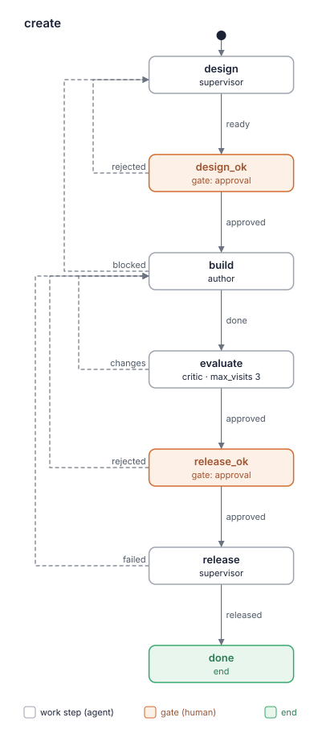
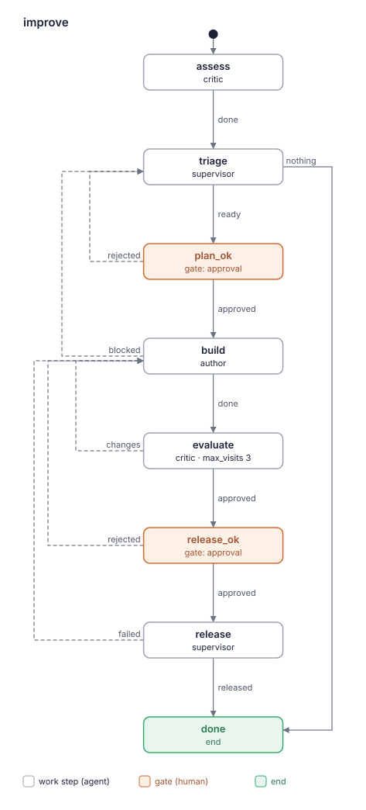

# Blueprint: kit-builder

A kit of the official LADO marketplace that helps a LADO user build a kit for their own
work, from "I know nothing about LADO" to a released tag, and evaluate any kit, theirs or
someone else's, before they put it to work. Users are anyone who runs LADO sessions; the
human talks only to the supervisor.

## 1. Requirements

What kit-builder must do, from its specification (`docs/spec.md`, stage 1 "MVP" and
v0.2.0), the experiment on lado-dev for 0.3.0 (`BACKLOG.md`), the flow diagram (R12) and
the self-evaluation for 0.4.0 (`kit-reports/kit-builder-0.4.0-2026-10-06.md`). Later
stages (trial runs, session metrics, `extend`) are not requirements of this version.

- **R1** Create a kit: take the human from an interview to a kit in their repository,
  released with a local tag `vX.Y.Z`, with the human approving the design and the release.
  *Source:* spec 1 "create", 4 flow `create`, 8 stage 1.
- **R2** Interview in rounds (question, context, recommendation), starting with "Do you
  already have a process you want to bring over?" and following the branch: transfer an
  existing process (read the human's CLAUDE.md, skills, process description, tracker
  statuses and map them to roles, steps and gates) or start from scratch. *Source:* spec 2,
  4 `design`, skill `kit-interview` in 4.
- **R3** Offer known team shapes when starting from scratch: nine archetypes with their
  roles, flow, when to take them and complexity; Solo is offered first; a group chat or a
  leaderless swarm only when the human asks. *Source:* spec 7.
- **R4** Write `BLUEPRINT.md` at the root of the built kit: requirements, starting point,
  traceability of every part to a requirement, complexity budget, change log. It is the one
  place that says why each part exists, and the author and critic work from it.
  *Source:* spec 5.
- **R5** Measure complexity: a script counts the measures of the budget table (worker roles,
  work steps and gates per flow, words per role prompt, own skills, MCP servers) with a
  green, yellow or red zone each (the lead's prompt with a higher limit), plus similar
  paragraphs across roles and steps; red fails.
  *Source:* spec 6a.
- **R6** Evaluate any kit, own or installed, given as a folder or an installed name:
  layer a (`lado kits check` and the budget) and layer b (a 12-criterion rubric, three
  passes, only repeated findings or one-pass findings the critic confirmed in the files,
  each with a quote). Every pass reads the dependency skills the roles list and checks a
  list of known holes by name. Findings are candidates for the human, not pass/fail. Given
  a previous report, the critic re-evaluates only the change: marks the previous findings,
  checks that no cut rule is lost, keeps findings in unchanged text apart and says whether
  the stop rule (no high or medium finding in the change) holds, as advice for the release
  gate, not a block; before it approves, one more pass covers every file the change
  touched, whole. *Source:* spec 2 S5, 4 flow `evaluate`, 6a, 6b; the human's notes on
  re-evaluating lado-dev 0.9.1–0.9.3 (13 → 7 → 7 findings, rules lost in cuts, confirmed
  findings dropped by the vote); the experiment 0.1.0 against 0.2.0 on lado-dev (the same
  critic found 11 and 20 findings on near-equal kits; a high found on one and not the
  other; "approved" with "stop rule not met").
- **R7** Report an evaluation as one file `kit-reports/<kit>-<version>-<date>.md`: a card
  (budget, result per layer, what the count covers), findings with quotes and files, "Fix
  first" with at most 5 items. *Source:* spec 6 "Report"; the experiment on lado-dev (a
  re-evaluation's 9 findings read against a full evaluation's 11).
- **R8** Release safely: set the version, pass `lado kits check . --tag vX.Y.Z`, commit and
  tag locally; push and a marketplace pull request only after the human's explicit yes,
  with the pull request text ready. A failure the environment causes (network, a missing
  tool, an existing tag, a dirty checkout, another branch checked out) goes to the human,
  never to the author, and is retried a bounded number of times; kit text that the merge
  of the start branch brings in goes back through the critic; a run that only adds a
  report is merged without a yes only when it touches nothing but `kit-reports/`. A
  release stopped by the environment stays in `release` until the human settles it,
  finishes by hand or cancels. *Source:* spec 4 `release`, 10;
  `kit-reports/kit-builder-0.4.0-2026-10-06.md` F3.1, F3.2, F4.1, F12.1 and the human's
  answers to its questions 3 and 5; its re-evaluation, F3.5 and question 1.
- **R9** Simplicity: the simplest kit that solves the task. A part enters a built kit only
  when a requirement needs it, and kit-builder itself stays within its own budget.
  *Source:* spec 1 "main principle", 4 "kit-builder passes its own budget".
- **R10** A marketplace user installs and starts it from the README (`lado kits add
  kit-builder -m official`, `lado start . --kit kit-builder`); the kit is in English and
  runs under any agent CLI LADO supports. *Source:* spec 3, 8 stage 1 "instructions";
  decisions in `docs/mvp-brief.md`.
- **R11** Improve an existing kit in a run, never by hand: from the critic's report of its
  current version (or a report of that version the human names), the human decides which
  findings to fix, answers the critic's questions and keeps or cuts each measure over
  green; a kit without `BLUEPRINT.md` gets one restored from its roles and flows, asking
  the human only about what the kit cannot tell and showing it whole at the plan's gate;
  the plan of changes passes a gate, the
  critic checks the result and the release goes through the same gate and step as in R8.
  The first assessment is a full evaluation of the whole kit, since later checks read only
  the change.
  *Source:* spec 4 flow `improve`, 8 v0.2.0; the human's notes on improving the kit
  lado-dev 0.9.1–0.9.4 (fixes assembled outside a run, tags outside `release`, "nothing
  justifies the yellow measures" in every report); the experiment on lado-dev (findings
  the first assessment missed were never looked for again in the run).
- **R12** Show each flow as a graph: the blueprint holds a skeleton of every flow (its
  states, agents, gates, outcomes and `max_visits`), drawn as SVG and committed next to it,
  so the human approves a picture at `design_ok` and `plan_ok`; the critic draws the built
  flows into its report, and a script lists every difference between the flows and the
  skeletons, which blocks the critic's approval, so drift from the approved plan is
  visible. In `improve` every blueprint without skeletons gets them. *Source:* the
  supervisor's task for the flow diagram (2026-10-06); the drawing is ported from the
  Tessera kit-builder's `scripts/render_workflow_diagram.py`; the human's answers to
  questions 1 and 2 of `kit-reports/kit-builder-0.4.0-2026-10-06.md`.

## 2. Starting point

Archetype 2, **Feature with design gate** (3 / 3 / 2), adapted:

- The designer is the supervisor, not a worker role: the design is the interview, and only
  the lead talks to the human in the chat. The supervisor also releases, because tagging and
  asking for the push are the human's conversation.
- The implementer is the `author`, the reviewer is the `critic`, which reviews with the
  budget script and the rubric instead of a code review.
- The work steps are four (`design`, `build`, `evaluate`, `release`) rather than three,
  because the release is a step of its own after the human's release gate.

Evaluating a kit alone is the **Solo** archetype (1 / 1 / 0): the flow `evaluate` with the
critic and no gate, since it changes nothing but a report file.

Improving a kit, the flow `improve`, is the same shape as `create` with five work steps and
two gates: `assess` (critic) and `triage` (supervisor) take the place of `design`.

### Flow skeletons

Drawn into `blueprint-flows/` by the `kit-budget` flow script; `--compare` checks
`flows/` against them.

```yaml
name: create
start: design
states:
  design:
    agent: supervisor
    outcomes: {ready: design_ok}
  design_ok:
    gate: approval
    outcomes: {approved: build, rejected: design}
  build:
    agent: author
    outcomes: {done: evaluate, blocked: design}
  evaluate:
    agent: critic
    max_visits: 3
    outcomes: {approved: release_ok, changes: build}
  release_ok:
    gate: approval
    outcomes: {approved: release, rejected: build}
  release:
    agent: supervisor
    outcomes: {released: done, failed: build}
  done:
    end: true
```



```yaml
name: improve
start: assess
states:
  assess:
    agent: critic
    outcomes: {done: triage}
  triage:
    agent: supervisor
    outcomes: {ready: plan_ok, nothing: done}
  plan_ok:
    gate: approval
    outcomes: {approved: build, rejected: triage}
  build:
    agent: author
    outcomes: {done: evaluate, blocked: triage}
  evaluate:
    agent: critic
    max_visits: 3
    outcomes: {approved: release_ok, changes: build}
  release_ok:
    gate: approval
    outcomes: {approved: release, rejected: build}
  release:
    agent: supervisor
    outcomes: {released: done, failed: build}
  done:
    end: true
```



```yaml
name: evaluate
start: evaluate
states:
  evaluate:
    agent: critic
    outcomes: {done: done}
  done:
    end: true
```


## 3. Traceability

| Element | Kind | Covers | Why it exists / why nothing simpler |
|---|---|---|---|
| `supervisor` | role (lead) | R1, R2, R3, R4, R6, R8, R11, R12 | Holds the conversation with the human: starts the run named after the kit, interview, blueprint, gates explained (with the critic's open findings and questions answered before the human decides), release and the push question. LADO gives the chat to the lead only. |
| `author` | role | R1, R8, R11, R12 | Writes the kit's files and changes them by an approved plan; after a failed release reruns the failing command and sends merged kit text that contradicts the blueprint to the human. A separate role so the critic's check is independent of the writer, and the supervisor stays the human's partner rather than a coder. |
| `critic` | role | R5, R6, R7, R11, R12 | Read-only evaluation with its own rights (writes only the report) and a fresh look; the same role serves all three flows and holds the verdict rule the flows' critic steps point to. |
| `create` | flow | R1, R4, R8 | The path interview → approved blueprint → kit → check → approved release → tag. |
| `create.design` | work step | R2, R3, R4, R12 | Interview and blueprint; its note is the whole blueprint, passed on with `needs`. |
| `create.design_ok` | gate | R1, R4, R12 | The blueprint is the human's decision: nothing gets built that they did not approve. |
| `create.build` | work step | R1 | The author writes the kit; on a later visit fixes the critic's findings. |
| `create.evaluate` | work step | R6, R9 | Independent check before release, `max_visits: 3` so the loop with `build` ends. |
| `create.release_ok` | gate | R1, R8 | Tagging is the human's call; on reject the work goes back to the author. |
| `create.release` | work step | R8 | Version, `lado kits check --tag`, merge onto the start branch, local tag, then the push question; a failure the environment causes goes to the human. |
| `improve` | flow | R4, R8, R11 | The path report → approved plan (and blueprint) → changed kit → check → approved release → tag. A separate flow rather than a branch of `create`: each step has one job and the interview is not carried into every fix. |
| `improve.assess` | work step | R6, R11 | The fact the plan starts from: always a full evaluation of the whole current version, or the human's full report of it, so it is not evaluated twice. |
| `improve.triage` | work step | R4, R11, R12 | The human's decisions on the report and the restored or updated blueprint; its note is the plan, passed on with `needs`. |
| `improve.plan_ok` | gate | R11, R12 | The plan is the human's decision, as the blueprint is in `create`. |
| `improve.build` | work step | R11 | The author changes the kit by the plan; on a later visit fixes the critic's findings. |
| `improve.evaluate` | work step | R6, R9, R11 | Independent check of the change, starting from the plan's findings; `max_visits: 3`. |
| `improve.release_ok` | gate | R8, R11 | Tagging is the human's call, as in `create`. |
| `improve.release` | work step | R8, R11 | The release of `create` with the plan's version; the procedure lives in `lado-kit-format` ("Releasing"), so both release steps point to it and the lead's prompt stays short. |
| `evaluate` | flow | R6, R7 | Evaluation alone, for a kit the human did not build here. |
| `evaluate.evaluate` | work step | R6, R7, R8 | The one critic step; no gate, since it only adds a report file, which the supervisor merges when the run's diff touches only `kit-reports/`. |
| `kit-interview` | skill | R2, R4, R11, R12 | Round format (independent questions batched in one round, dependent ones one by one), branches (with "Existing kit": restoring a blueprint, going through a report, the plan's form), question bank, mapping the human's material, the blueprint template with its flow skeletons. |
| `kit-archetypes` | skill | R3, R9 | The nine shapes, Solo first, and the checks every shape passes. |
| `lado-kit-format` | skill | R1, R6, R8, R10 | The format, the rules `lado kits check` does not prove (provider neutrality, paths, one lead, notes and `needs`, gates, `max_visits`), the release procedure (with a report-only run, which takes only its own report files), the one rule for telling an environment failure from a kit fault, which every role points to, and what a marketplace pull request needs; every role writes or reads kits, and the author reruns the release's failing command. |
| `kit-budget` | skill | R5, R9, R12 | The budget table and the script `scripts/kit_budget.py`; used by the author before reporting, the critic in layer a and the supervisor for the planned budget. Also `scripts/flow_diagram.py`, which draws the skeletons and the flows and compares them (R12): in this skill rather than a sixth one, since both are scripts over the kit's shape that every role already runs, and a sixth skill makes the kit yellow. |
| `kit-rubric` | skill | R6, R7, R8, R12 | The 12 criteria, the known holes, where to read dependency skills, the finding format, the three-pass rule, re-evaluation against a previous report, the one verdict rule (a flow differing from its skeleton blocks; a check failing for an environment cause gives no verdict) with the stop rule as advice, and the report template (in the run's human language). On the critic, and on the author and the supervisor, who fix and weigh findings named by its criteria. |
| `mattpocock-skills` (`grilling`, `writing-for-agents`) | skill dependency | R1, R2 | `grilling` finds what is still the human's to decide in the interview, with `kit-interview`'s round format and scope winning where they differ; `writing-for-agents` makes the blueprint and the kit's prompts readable by agents that never saw the interview. Shared, so not copied (decision in `docs/mvp-brief.md`). `kit.yaml` cannot list the kit's own skills (LADO finds them in `skills/`), so the rule is: every skill from outside the kit that a role uses is declared in `dependencies.skills` by its own folder; `folders` names only these two, so no unused skill is installed. |
| — | MCP server | — | None: the work is files and the `lado` and `git` commands. |

Reverse check:

- R1: `supervisor`, `author`, `create`, `create.design_ok`, `create.build`,
  `create.release_ok`, `lado-kit-format`, `writing-for-agents`.
- R2: `supervisor`, `create.design`, `kit-interview`, `grilling`.
- R3: `supervisor`, `create.design`, `kit-archetypes`.
- R4: `supervisor`, `create`, `create.design`, `create.design_ok`, `improve`,
  `improve.triage`, `kit-interview`.
- R5: `critic`, `kit-budget`.
- R6: `supervisor`, `critic`, `create.evaluate`, `improve.assess`, `improve.evaluate`,
  `evaluate`, `evaluate.evaluate`, `lado-kit-format`, `kit-rubric`.
- R7: `critic`, `evaluate`, `evaluate.evaluate`, `kit-rubric`.
- R8: `supervisor`, `author`, `create`, `create.release_ok`, `create.release`, `improve`,
  `improve.release_ok`, `improve.release`, `evaluate.evaluate`, `lado-kit-format`,
  `kit-rubric`.
- R9: `create.evaluate`, `improve.evaluate`, `kit-archetypes`, `kit-budget`, and this
  blueprint's budget below.
- R10: `lado-kit-format` (provider neutrality); the README and `dependencies.lado: ">=0.23"`
  in `kit.yaml` (not kit elements in the sense of section 3).
- R11: `supervisor`, `author`, `critic`, `improve` and its seven states, `kit-interview`.
- R12: `supervisor`, `author`, `critic`, `create.design`, `create.design_ok`,
  `improve.triage`, `improve.plan_ok`, `kit-interview`, `kit-budget`, `kit-rubric`.

## 4. Complexity budget

Output of `uv run --script skills/kit-budget/scripts/kit_budget.py .` at the repository
root (exit status 0), for 0.4.0: after the changes for 0.3.0 (known holes, dependency skills, the full
pass and one verdict rule in `kit-rubric`; `kit-rubric` on the author and the supervisor),
the flow diagram (R12) and the fixes of `kit-reports/kit-builder-0.4.0-2026-10-06.md`:

```
# Complexity budget: kit-builder 0.4.0

| Measure | Where | Value | Green / yellow up to | Zone |
|---|---|---|---|---|
| Worker roles (not supervisor) | kit | 2 | 3 / 5 | green |
| Work steps in a flow | flows/create.yaml | 4 | 5 / 8 | green |
| Work steps in a flow | flows/evaluate.yaml | 1 | 5 / 8 | green |
| Work steps in a flow | flows/improve.yaml | 5 | 5 / 8 | green |
| Gates in a flow | flows/create.yaml | 2 | 2 / 3 | green |
| Gates in a flow | flows/evaluate.yaml | 0 | 2 / 3 | green |
| Gates in a flow | flows/improve.yaml | 2 | 2 / 3 | green |
| Words in a role prompt | agents/author.md | 788 | 800 / 1500 | green |
| Words in a role prompt | agents/critic.md | 674 | 800 / 1500 | green |
| Words in the lead's prompt | agents/supervisor.md | 768 | 1000 / 1500 | green |
| Own skills | kit | 5 | 5 / 10 | green |
| MCP servers | kit | 0 | 2 / 4 | green |

## Similar paragraphs (one rule, one place; 55% similar or more)

none

Overall: green
```

No measure is over green, so none needs a reason. Five sit at the edge of green, each
kept because a requirement needs it and nothing simpler covers it; the lead's prompt, last
below, was near it until 0.4.0:

- Work steps in `improve` (5 of 5): `assess` and `triage` are what `improve` adds to the
  shape of `create` (R11). `assess` is the critic's (the plan must start from an
  independent report, R6) and `triage` the supervisor's (only the lead talks to the human),
  so they cannot be one step; `build`, `evaluate` and `release` are those of `create`.
  Another step makes the kit yellow and needs a reason here.
- Gates in `create` and in `improve` (2 of 2 each): the human approves what gets built (the
  blueprint, the plan) and what gets tagged (R1, R8, R11); neither can be folded into the
  other, since the critic's check sits between them.
- Own skills (5 of 5): each holds what more than one role needs or what would bloat a
  prompt (section 3); a sixth makes the kit yellow.
- Words in the author's prompt (788 of 800): the author writes, fixes by plan and report,
  and handles a failed release. Its release and failure rules point to `lado-kit-format`
  rather than restate them; a rule added to it should push another one into a skill.
- Words in the lead's prompt (768 of 1000): the supervisor runs three flows, the interview
  and the gates' conversation. Rules it alone needs stay in it; shared ones are in skills,
  and the release procedure moved into `lado-kit-format` ("Releasing") with the fixes for
  0.4.0. A rule added to it should push another one into a skill rather than make it
  yellow.

## 5. Change log

Filled by `improve`, newest first.

| Date | Version | Change | ← Fact (session, run, metric or report) |
|---|---|---|---|
| 2026-10-06 | 0.4.0 | Flow diagram (R12): `kit-budget/scripts/flow_diagram.py` draws each flow as SVG and compares `flows/` with flow skeletons in `BLUEPRINT.md` section 2 (template in `kit-interview`); the supervisor commits the drawn skeletons in `blueprint-flows/` and points the human to them at `design_ok` and `plan_ok`; the author compares before reporting; the critic draws the built flows into its report and lists each difference under "Not traced". In `kit-budget`, not a sixth skill, to keep "Own skills" green. Then the fixes of the self-evaluation of 0.4.0 (R8, R11, R12): the release procedure moved from the supervisor into `lado-kit-format` ("Releasing"), where a failure the environment causes goes to the human with bounded retries and only a kit fault goes to the author, a refused fast-forward is read by its cause, kit text the start branch brings in at release goes back through `evaluate`, and a report-only run is merged only when it touches `kit-reports/` alone (else the report alone, or the human's yes); the verdict blocks on a `--compare` difference, counts a similar pair as a criterion-6 finding and gives no verdict on an environment failure; `triage` gives skeletons to every blueprint without them, shows a restored one whole at `plan_ok` and starts a revised plan with what changed; `kit-interview` wins over `grilling` on round format and scope; a red measure goes to the human through the lead; repeats cut in the critic and history in `kit-budget` | The supervisor's task for the flow diagram; ported from the Tessera kit-builder's `render_workflow_diagram.py`; `kit-reports/kit-builder-0.4.0-2026-10-06.md`: F3.1 high, F2.1, F2.2, F3.2, F3.3, F4.1, F4.2, F5.1, F5.2, F12.1 medium, F3.4, F6.1, F7.1, F9.1 low, and the human's answers to its five questions. Round 2, from the re-evaluation: the rule for a failure from outside the kit's files is one section of `lado-kit-format` ("When a check or command fails") that the author, the critic (every check, `assess` included) and the release point to, with no copy in `kit-rubric`; a release stopped by the environment or at the retry bound stays in `release` (finish by hand with `lado flow-set … done`, or cancel); an existing tag sends the version back to step 1; the merged-text test uses `kit-rubric`'s kit text; a report-only run takes only its own report paths and commits only those, and a conflict there goes to the human; "Changed since the plan the author last built"; the author changes no merged kit text and reports `blocked` when it contradicts the blueprint; the supervisor looks facts up itself, never through a sub-agent; README's `evaluate` merge; R8 on `author` and `evaluate.evaluate` | `kit-reports/kit-builder-0.4.0-2026-10-06.md` (re-evaluation of 2bc37d1): F2.2 still open, F3.5, F3.6, F3.8, F5.3, F7.2, F12.2 medium, F3.7, F6.2 low, F3.9, F3.10, F12.3 missed earlier, the R8 trace note, and the human's answers to its three questions |
| 2026-10-06 | 0.3.0 | Critic recall and one verdict rule (R6, R7, R11): every pass reads the dependency skills the roles list and checks five known holes by name; `improve.assess` is always a full evaluation; before `approved` one full pass over every file the diff touched; one verdict rule in `kit-rubric`, where the stop rule is advice for the release gate, not a block; the card says what the count covers. Also `kit-rubric` on the author and the supervisor, `mattpocock-skills` narrowed to `grilling` and `writing-for-agents`, a blueprint names its archetype without the skill's name; `lado-kit-format` states that every skill from outside the kit a role uses is declared in `dependencies.skills` by its own folder | `BACKLOG.md`, "Experiment: kit-builder 0.1.0 against 0.2.0 on lado-dev": 11 and 20 findings by the same critic on near-equal kits, the `brainstorming` high found on 0.9.1 and not on 0.9.4, five fixed findings missed by the first assessment, `approved` with "stop rule not met: 1 medium", 9 changed-text findings read against 11 full ones; "Skills kit-builder 0.2.0 uses" |
| 2026-10-06 | 0.2.0 | Fixes of the self-evaluation (R6, R8, R11): `improve.build` takes later visits, section 4 and a revised plan; the author resolves a release conflict; the re-evaluation base is in the plan; `improve` starts from the last report of the kit's content; the human's own changes have a place in the plan; the options at the loop limit; the publishing convention and "what is left" back | `kit-reports/kit-builder-0.2.0-2026-10-06.md` (re-evaluation against 0.1.0): F5.1 high, F2.1, F2.2, F2.3, F7.1, F7.2, F8.1 medium, the cut-rule check |
| 2026-10-06 | 0.2.0 | `kit-budget` (R5): the lead's prompt gets its own limit (1000 words), similar paragraphs by content-word Jaccard (55%) instead of exact repeats; the author's "cut → where the rule is now" table | The human's notes on lado-dev 0.9.1–0.9.4: roles squeezed to 799 words broke text, the duplicate detector dodged by rewording |
| 2026-10-06 | 0.2.0 | Re-evaluation in `kit-rubric` (R6): review of the diff against the previous report, cut-rule check, "Missed earlier", stop rule; one-pass findings confirmed by the critic kept; the report in the run's human language | The human's notes on lado-dev 0.9.1–0.9.3: 13 → 7 → 7 findings with no end in sight, "with the log outside the tree" and fix F5.3 lost in cuts, two confirmed findings dropped by "2 of 3", the first report in English in a `ru` run |
| 2026-10-06 | 0.2.0 | Flow `improve` (R11), the branch "Existing kit" of `kit-interview`; the shared rules of build, evaluate and release moved into the roles | The human's notes on the session over the kit lado-dev 0.9.1–0.9.4: fixes assembled outside a run, tags outside `release`, "nothing justifies the yellow measures" in every report |
