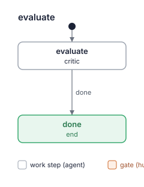

# Kit report: kit-builder 0.4.0

- Date: 2026-10-06
- Kit: the repository root of kit-builder (path given), branch `lado/kit-builder/critic`.
  `kit.yaml` still says `version: 0.3.0`; the report is named for the planned 0.4.0, as the
  supervisor's task asks (the version is set at release).
- Commit: d4868fe
- Evaluated by: kit-builder critic (layers a and b), run on kit-builder itself following
  `agents/critic.md` and `kit-rubric` as in the `evaluate` step of `improve`, outside a run
- Mode: full evaluation of the whole kit. There is no report of 0.3.0 in `kit-reports/`, so
  no re-evaluation. The change since `v0.3.0` (`git diff v0.3.0..HEAD`: flow diagrams, R12)
  got extra attention, and each finding in text that diff touches is marked **[changed]**.
- Passes: three independent sub-agents, each with `kit-rubric`, the kit folder and the two
  dependency skills' folders only (no diff). Pass 1 started from kit.yaml and the roles,
  pass 2 from the flows state by state, pass 3 from the skills and the two scripts, then
  back to the roles. Findings were merged by place and reason; where passes gave different
  impacts or criteria, the higher impact and the criterion closest to the fix were taken
  (said in the finding). 6 one-pass findings dropped, 4 kept as confirmed. One more
  finding (F2.1) came from the critic's own reading of the diff and is kept because the
  command output in it shows the harm; it is marked "critic's check, confirmed".

Findings are candidates for the human to weigh, not a pass/fail grade.

**Verdict: `changes`** — one high finding is open (F3.1). `lado kits check` has no error,
no budget measure is over green, and the flows match the blueprint's skeletons.

## Card

| Layer | Result |
|---|---|
| a. `lado kits check` | OK; 0 warnings |
| a. Budget | green; no measure over green, no similar paragraphs |
| a. Flows | 3 drawn; same as the blueprint's skeletons (0 differences) |
| b. Rubric | 15 findings (1 high, 10 medium, 4 low); 4 of 12 criteria without findings |
| Covers | full evaluation of the whole kit, 18 files (kit.yaml, README.md, BLUEPRINT.md, 3 roles, 3 flows, 5 SKILL.md, 2 templates, 2 scripts) and the 2 dependency skills; 5 findings in the text changed since v0.3.0 |

The count covers only what the row "Covers" names: a count of a re-evaluation and one of a
full evaluation are not comparable.

### `lado kits check .`

```
kit-builder: OK (2 agents, 7 skills, 1 packs and 3 flows)
```

### Budget script (exit status 0)

```
# Complexity budget: kit-builder 0.3.0

| Measure | Where | Value | Green / yellow up to | Zone |
|---|---|---|---|---|
| Worker roles (not supervisor) | kit | 2 | 3 / 5 | green |
| Work steps in a flow | flows/create.yaml | 4 | 5 / 8 | green |
| Work steps in a flow | flows/evaluate.yaml | 1 | 5 / 8 | green |
| Work steps in a flow | flows/improve.yaml | 5 | 5 / 8 | green |
| Gates in a flow | flows/create.yaml | 2 | 2 / 3 | green |
| Gates in a flow | flows/evaluate.yaml | 0 | 2 / 3 | green |
| Gates in a flow | flows/improve.yaml | 2 | 2 / 3 | green |
| Words in a role prompt | agents/author.md | 730 | 800 / 1500 | green |
| Words in a role prompt | agents/critic.md | 700 | 800 / 1500 | green |
| Words in the lead's prompt | agents/supervisor.md | 952 | 1000 / 1500 | green |
| Own skills | kit | 5 | 5 / 10 | green |
| MCP servers | kit | 0 | 2 / 4 | green |

## Similar paragraphs (one rule, one place; 55% similar or more)

none

Overall: green
```

### Flows

`uv run --script skills/kit-budget/scripts/flow_diagram.py . --out kit-reports/kit-builder-0.4.0-2026-10-06`
(exit status 0). The three SVGs are byte-identical to `blueprint-flows/*.svg`.




`uv run --script skills/kit-budget/scripts/flow_diagram.py . --compare BLUEPRINT.md`:

```
same as the plan in BLUEPRINT.md (exit status 0)
```

## Fix first

1. Tell a fault of the environment from one of the kit before the release sends a red
   `lado kits check --tag` back to the author (F3.1).
2. Make a difference that `--compare` prints block `approved`, or show it to the human at
   `release_ok`. R12 promises this, but the verdict leaves it out (F3.3, **[changed]**).
3. Give an existing blueprint without flow skeletons its skeletons in `triage`. Otherwise
   the author's `--compare` exits 2 on every kit built by kit-builder ≤ 0.3.0 (F2.1,
   **[changed]**).
4. Read a refused `git merge --ff-only` by its cause: a moved branch goes back to step 2,
   a dirty or other checkout goes to the human (F3.2).
5. Name the target branch and the content check for the merge after `evaluate` and after
   `nothing`, and say how to merge "only the report" (F12.1).

## Findings

### 1. Role boundaries

No finding. Every role states its rights. The supervisor: "the kit's roles, flows or skills
yourself: the author writes them, the critic checks them." (`agents/supervisor.md:15`). The
author does not add or drop parts it is not told to: "so you do not add, drop or rename a
role, step, gate, skill or MCP server they do not name." (`agents/author.md:13`). The critic:
"it. You change no file of the kit you evaluate; you write only the report and its flow"
(`agents/critic.md:10`), which the diff widened to the diagrams consistently in all three
places.

### 2. Handoffs between steps

- **F2.1** [medium] **[changed]** `agents/author.md:33` (state `build` of `improve`)
  > and its flow script with `--compare BLUEPRINT.md`. The flow skeletons are the human's

  The author always runs `--compare`. But `triage` adds skeletons only to a blueprint it
  restores: `skills/kit-interview/SKILL.md:136-137` says "A restored blueprint gets
  skeletons of the kit's flows" / "as they are; the plan's changes to a flow change its
  skeleton.". A kit whose `BLUEPRINT.md` predates R12 has no skeletons, and that includes
  every kit built by kit-builder ≤ 0.3.0 and kit-builder's own blueprint at v0.3.0. On
  such a kit the author's check fails, and the author reports `blocked`. The run then goes
  back to `triage` and through `plan_ok` once more, and the human approves a plan again
  for a gap in the kit's own instructions.
  Fix: in `kit-interview` ("The blueprint"), "a blueprint without skeletons, restored or
  not, gets skeletons of the kit's flows as they are". Optionally, make the author's
  check conditional the way the critic's step 3 is ("when `BLUEPRINT.md` has flow
  skeletons").
  Passes: critic's check, confirmed. Evidence: `git show v0.3.0:BLUEPRINT.md` checked with
  `flow_diagram.py . --compare` printed
  `error: …/bp030.md: no ```yaml block with states:` (exit 2).

- **F2.2** [medium] `flows/improve.yaml:59` (state `build`, after `blocked`)
  > After `blocked`, the previous note is the revised plan: change what differs from the
  > plan you built.

  `build` has `needs: [triage]` (`flows/improve.yaml:54`), so it gets only triage's latest
  note. The plan it built before is in neither the previous note nor a `needs` state, and
  the plan is a note, not a committed file. A fresh author cannot tell what differs, so it
  either rebuilds everything or guesses. `create.build` avoids this by pointing at the
  committed blueprint's diff ("change what its diff on the run's branch changed",
  `flows/create.yaml:45`).
  Fix: triage's later-visit note starts with "Changed since the previous plan: …", or
  `improve.build` gets `needs: [triage, build]`.
  Passes: 1/3, confirmed. Evidence: `flows/improve.yaml:54` "needs: [triage]".

### 3. Done and outcomes

- **F3.1** [high] `agents/supervisor.md:67` (state `release` of `create` and `improve`)
  > `lado kits check . --tag vX.Y.Z` there; if it does not print OK, report `failed` with
  > its output. The author fixes either on the run's branch.

  This is known hole 1. Every red `--tag` check goes to `build` as a fault of the kit,
  whatever its cause:
  - no network to fetch the `mattpocock-skills` pack;
  - a missing `uv` or `lado`;
  - a tag that already exists;
  - a version the supervisor set wrongly in step 1.

  The author's own done condition uses `lado kits check .` without `--tag`, so it cannot
  even reproduce such a failure. Its way out is `blocked` ("something `lado kits check`
  rejects", `agents/author.md:74`). That sends `create` back to `design` and `improve`
  back to `triage`, and from there through a gate and another critic visit, all for a
  fault no one in the kit can fix. Worse, the author may "fix" the kit to get past it, for
  example by dropping a dependency.
  The critic's verdict has the same gap: "`approved` when `lado kits check` has no error"
  (`skills/kit-rubric/SKILL.md:230`) counts an environment error as `changes`.
  Passes 2 and 3 rated this high, pass 1 medium; high is kept, since the run can loop
  through gates and the author can damage the kit.
  Fix: in Release step 2, "a failure the kit's files do not cause (network, a missing
  tool, an existing tag, a dirty checkout): settle it or ask the human; report `failed`
  only for a fault in the kit". Say the same in kit-rubric "Verdict", and tell the author
  to rerun the failing command as given, `--tag` included.
  Passes: 3/3

- **F3.2** [medium] `agents/supervisor.md:71` (state `release`)
  > fast-forward, the branch moved meanwhile: go back to step 2. Then `git tag vX.Y.Z`

  This is known hole 1. The line names one cause for a refused `git merge --ff-only` in
  the human's checkout. Uncommitted or untracked files the merge would overwrite cause it
  too, and so does another branch being checked out; the role itself writes `BACKLOG.md`
  there (`agents/supervisor.md:95-96`). Going back to step 2 changes nothing in those
  cases, so steps 2–3 repeat with no bound inside one step, or the supervisor "cleans"
  the human's checkout to get through.
  Fix: "if it cannot fast-forward because the branch moved, go back to step 2; for any
  other error (local changes, another branch checked out), show it to the human and
  wait; never stash or reset their changes".
  Passes: 3/3

- **F3.3** [medium] **[changed]** `skills/kit-rubric/SKILL.md:231` (states `evaluate` of
  `create` and `improve`, gate `release_ok`)
  > is red, every yellow measure is justified in the blueprint and no high finding is open;

  The verdict leaves out the differences `--compare` prints. The changed text files them
  under "Not traced" (`skills/kit-rubric/SKILL.md:178`, "between the flows and the
  blueprint's skeletons: the kit drifted from what the human"). At `release_ok` the
  supervisor shows "the critic's open findings (with "Missed earlier"), whether its stop
  rule holds" (`agents/supervisor.md:87`), not "Not traced". So a flow that drifted
  from the skeleton the human approved can be `approved` and tagged without the human
  seeing the drift. R12 promises the opposite: "skeletons as a finding, so drift from the
  approved plan is visible" (`BLUEPRINT.md:78`).
  Pass 2 filed this under criterion 3; pass 3 noted only the wording mismatch with R12,
  under "Not traced". Criterion 3 is kept, since the fix is the outcome's condition.
  Fix: add "and the flow script's `--compare` prints no difference" to the verdict, or
  have the supervisor show "Not traced" at `release_ok`.
  Passes: 2/3

- **F3.4** [low] `skills/kit-budget/SKILL.md:86`
  > Each pair is yellow: it makes the overall zone at least yellow but never red. Fix it by

  The verdict asks that "every yellow measure is justified in the blueprint"
  (`skills/kit-rubric/SKILL.md:231`). A similar-paragraph pair is yellow, but it is not a
  measure, and kit-budget says to fix it rather than justify it. Whether an open pair
  blocks `approved` is left to each critic.
  Fix: in kit-rubric "Verdict", say whether a pair blocks, or that it is a finding under
  criterion 6 with its own impact.
  Passes: 1/3, confirmed. Evidence: both quotes as given; neither file says how a pair
  counts in the verdict.

### 4. Independent verification

- **F4.1** [medium] `agents/supervisor.md:64` (state `release`, after gate `release_ok`)
  > 2. In the run's worktree, merge the branch the run started from (checked out in your

  After the critic's `approved` and the human's `release_ok`, the supervisor merges in
  whatever the start branch gained since, such as another run's change or the human's own
  commits. On a clean merge it tags the result after `lado kits check --tag` alone; only
  a merge conflict (`agents/supervisor.md:65-66`) goes back to the author. The tagged text was
  then never seen by the critic or shown to the human, and a clean git merge can still
  join two role texts that contradict each other.
  Passes 1 and 3 rated this medium, pass 2 low; medium is kept.
  Fix: "if the merge brought commits that change `kit.yaml`, `README.md`, `BLUEPRINT.md`,
  `agents/`, `flows/` or `skills/`, report `failed` so the merged kit passes `evaluate`
  again".
  Passes: 3/3

- **F4.2** [medium] **[changed]** `flows/improve.yaml:49` (gate `plan_ok`)
  > Approve the plan and the flow diagrams it changes (`blueprint-flows/`)? The author

  The gate shows triage's note, the plan, whose blueprint line is a summary: "Blueprint:
  <what changed in sections 1–4, or "unchanged">" (`skills/kit-interview/SKILL.md:81`).
  When triage restored `BLUEPRINT.md`, the human approves inferred requirements and a
  trace they never saw whole, and the author and the critic then work against them. The
  kit itself asks for the whole blueprint in the `nothing` case: "it whole, says yes
  (otherwise only the report)." (`flows/improve.yaml:44`).
  Fix: in triage's `do`, "when you restored `BLUEPRINT.md`, the note carries it whole
  after the plan".
  Passes: 1/3, confirmed. Evidence: the plan's form at `skills/kit-interview/SKILL.md:76-81`
  holds no blueprint text, and `plan_ok` has no `needs`.

### 5. Contradictions

- **F5.1** [medium] `agents/supervisor.md:49` (states `design`, `triage`)
  > Use `grilling` to find what is still the human's to decide; never decide for them what only

  The supervisor gets two interview prescriptions that cannot both hold:
  - **Round format.** grilling: "❓ **Q1** - **<question title>**: <question body, might
    be multiple paragraphs, including multiple choices>". kit-interview: "**Question.**
    <one question, answerable in a sentence>" (`skills/kit-interview/SKILL.md:17`), then
    Context and Recommendation.
  - **How far to go.** grilling: "Interview the user relentlessly until you reach a
    shared understanding." kit-interview: "ask only what changes the kit, and find the
    rest yourself" (`skills/kit-interview/SKILL.md:9-10`).

  grilling also says "dispatch a sub-agent to find it". Not every CLI can follow that, and
  in LADO it may turn into a worker outside a run. The interview's format and length will
  vary from run to run.
  Fix: in supervisor §2, "rounds in `kit-interview`'s format and scope; from `grilling`
  take only the design tree and the frontier". Or drop `grilling`, since kit-interview
  lines 22–24 already hold the frontier rule.
  Passes: 3/3

- **F5.2** [medium] `skills/kit-budget/SKILL.md:96-97` (on the author and the critic)
  > - Red: cut it before release (merge roles or steps, move text into a skill). The thresholds
  > are starting values: if a red measure truly cannot be cut, tell the human; changing a

  This is known hole 5. kit-budget is listed on the author and the critic, and it tells
  them to merge roles or steps and to "tell the human". The author: "so you do not add,
  drop or rename a role, step, gate, skill or MCP server they do not name."
  (`agents/author.md:13`). The critic: "Ask nothing of the human directly"
  (`agents/critic.md:81`). A worker that follows the skill writes to the human directly
  or cuts a role on its own.
  Fix: "If a red measure cannot be cut, the lead takes it to the human: the author
  reports `blocked`, the critic puts it under "Questions for the human"".
  Passes: 1/3, confirmed. Evidence: the three quotes above.

### 6. Duplication

- **F6.1** [low] **[changed]** `agents/critic.md:79`
  > - Read and run checks; change no file but your report and its diagrams. A fix you would

  This restates the role's opening, `agents/critic.md:10` "it. You change no file of the kit
  you evaluate; you write only the report and its flow". The diff had to change both
  copies for R12, which is the cost of the repeat. "Candidates, not a pass/fail grade" is
  likewise in `agents/critic.md:12`, `agents/critic.md:64` and `skills/kit-rubric/SKILL.md:10`.
  Fix: keep the rights in the opening and the "candidates" rule in kit-rubric; cut the
  repeats.
  Passes: 3/3

### 7. When to call the human

- **F7.1** [low] `agents/critic.md:26` (state `evaluate` of flow `evaluate`)
  > printed with `send_message`, and leave the run where it is.

  The step's only outcome is `done` (`flows/evaluate.yaml:15`). When the kit cannot be
  found, the run stays parked. The supervisor's blocked rule ("settle it yourself if it
  is yours to decide", `agents/supervisor.md:94`) doesn't say whether to correct the task
  or cancel the run.
  Pass 1 filed this under criterion 7, pass 3 under 3; 7 is kept, since the fix is a path
  to the human.
  Fix: in supervisor §5, "a critic that cannot find the kit: give it the corrected path
  or name, or ask the human to cancel the run".
  Passes: 2/3

### 8. Loops on a later visit

No finding. `design`, `triage` and `evaluate` need themselves. Their later visits are
described ("On a later visit revise `BLUEPRINT.md` as committed in the run's worktree, not
your", `flows/create.yaml:24`; the critic's "Re-evaluation"). `evaluate` has
`max_visits: 3`, and the other loops pass through gates. One gap of `improve.build`'s
later visit is F2.2.

### 9. Concision and why

- **F9.1** [low] **[changed]** `skills/kit-budget/SKILL.md:125`
  > The drawing is ported from the Tessera kit-builder's `render_workflow_diagram.py`.

  This is history in a skill every role loads, and it changes nothing an agent does. The
  script's docstring already credits Tessera. The calibration paragraph at lines 79–84 is
  similar exposition beyond the reason it gives for 55%.
  Fix: delete line 125, and cut lines 79–84 to the one sentence that justifies the
  threshold.
  Passes: 3/3

### 10. Skill descriptions

No finding. Each own skill's description says when to use it and names its neighbour, for
example "for judging a kit's text against review criteria use kit-rubric"
(`skills/lado-kit-format/SKILL.md:3`). kit-budget's new description adds the flow script
and its "when" ("or its flow diagrams"). Every listed skill is used by its role or steps.
Both dependency skills are declared by their own folders: "folders:
[skills/productivity/grilling, skills/productivity/writing-for-agents]" (`kit.yaml:15`).
Both were found in LADO's cache and read.

### 11. Provider neutrality

No finding in the kit's own text. Kit files are reached through `${SKILL_DIR}`, with a
fallback: "Your agent CLI may expand `${SKILL_DIR}` to that folder; if it does not, put
the" (`skills/kit-budget/SKILL.md:14`). The new script holds no absolute or home path, and
only LADO's tools are named. grilling's "dispatch a sub-agent" is part of F5.1.

### 12. Safety and scope

- **F12.1** [medium] `agents/supervisor.md:35` (after a run of `evaluate`; after
  `improve.triage` → `nothing`)
  > path breaks in the run's worktree). When the run ends, merge its branch (it holds the

  This is known hole 2. A merge into the human's repository happens after the run, with
  no gate and no yes. Nothing says onto which branch, or how (fast-forward or not), and
  nothing checks the premise "it only adds a report file" (`BLUEPRINT.md:202`). In the
  `nothing` case, `flows/improve.yaml:43-44` says "its branch as after `evaluate`, with a
  restored blueprint only if the human, shown" / "it whole, says yes (otherwise only the
  report).". But triage has already committed `BLUEPRINT.md` on that branch, and nothing
  says how to merge only the report, so the supervisor merges the unapproved blueprint or
  improvises.
  Pass 2 rated this low, passes 1 and 3 medium; medium is kept.
  Fix: "merge it into the branch the run started from when `git diff --stat` shows only
  `kit-reports/` (and `blueprint-flows/`/`BLUEPRINT.md` after the human's yes); otherwise
  show the human", plus how to take only the report (check out `kit-reports/` from the
  run's branch and commit).
  Passes: 3/3

## Known holes

| Known hole | Finding, or how the kit handles it |
|---|---|
| 1. Red check sent back with no environment cause considered | F3.1 (red `--tag` check → author; the verdict counts any check error), F3.2 (refused ff-merge always read as "branch moved") |
| 2. Work outside a flow, merge without a gate | Changes are handled: "Every change to a kit goes through a run of `create` or `improve`, never a worker or a" (`agents/supervisor.md:16`); tag behind `release_ok`, push and PR behind "the human's yes in the chat, in this session" (`agents/supervisor.md:75`). Open: F12.1 (merge after `evaluate` / `nothing`). |
| 3. Path outside the run's worktree | Handled: "`evaluate`, with the kit's installed name or absolute folder path as the task (a relative" (`agents/supervisor.md:34`); "path is in `flow_status` for the run), draw its flow skeletons into" (`flows/create.yaml:20`); "during a run that root is the run's worktree" (`skills/kit-interview/SKILL.md:126`). The release's merge in the human's checkout is deliberate, behind `release_ok`; its failure handling is F3.2. |
| 4. Verdict without a severity threshold | Handled: "is red, every yellow measure is justified in the blueprint and no high finding is open;" / "otherwise `changes`. Medium and low findings, findings under "Missed earlier" and those" (`skills/kit-rubric/SKILL.md:231-232`). Gaps: flow drift (F3.3), similar pairs (F3.4). |
| 5. Dependency skill that writes or asks where its role must not | `grilling` (asks the user) is only on the supervisor, the lead; `writing-for-agents` neither writes nor asks; the critic lists no dependency skill. Open: the own skill kit-budget tells the author and critic to "tell the human" (F5.2). |

## Not traced

- Elements: none untraced. Every role, every work and gate state of the three flows, all
  five own skills and the dependency pack appear in `BLUEPRINT.md` section 3 with a
  requirement, and the reverse check covers R1–R12. No MCP servers.
- Measures: none yellow or red. Section 4 matches the script's output except its
  header's version, which is still `kit-builder 0.3.0`, as is `kit.yaml`.
- Flows against skeletons: `same as the plan in BLUEPRINT.md` (exit 0), no difference.
- Wording: R12 says differences are listed "as a finding" (`BLUEPRINT.md:78`), while
  `kit-rubric` puts them here, under "Not traced", outside the verdict. See F3.3.

## Questions for the human

1. Should a flow that differs from its approved skeleton block `approved` (F3.3)?
   Recommended: yes, add "`--compare` prints no difference" to the verdict, as R12 already
   promises.
2. In `improve`, should every blueprint without skeletons get them in `triage`, not only a
   restored one (F2.1)? Recommended: yes. It touches every kit built by kit-builder ≤ 0.3.0.
3. After `release_ok`, if merging the start branch brings in changed kit text, should the
   release go back through `evaluate` (F4.1)? Recommended: yes, report `failed` when kit
   text changed. A clean merge of only `kit-reports/` or `BACKLOG.md` goes on.
4. Keep `grilling` as a dependency (F5.1)? Recommended: keep it, with one line saying that
   `kit-interview`'s round format and scope win. Dropping it is the simpler alternative,
   since kit-interview already holds the frontier rule.
5. Should the merge after `evaluate` / `nothing` stay without a yes (F12.1)? Recommended:
   no yes, but a content check: merge only when the diff touches `kit-reports/` alone.
   Anything else goes to the human.
